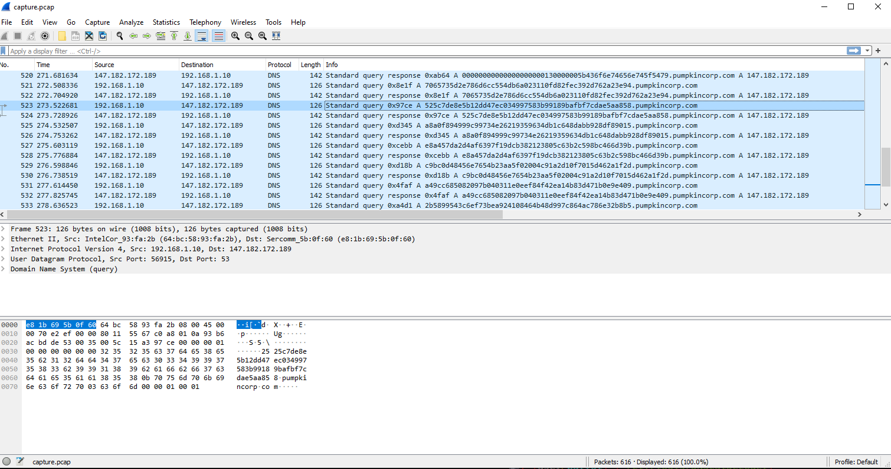
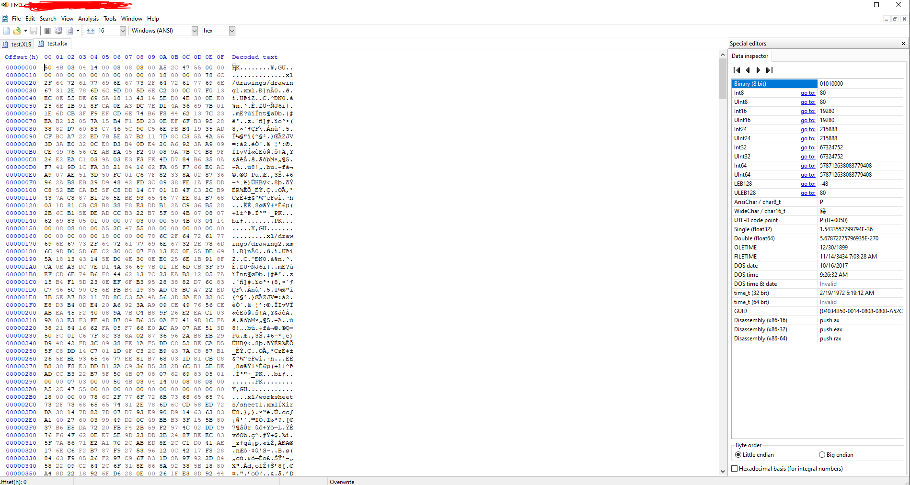
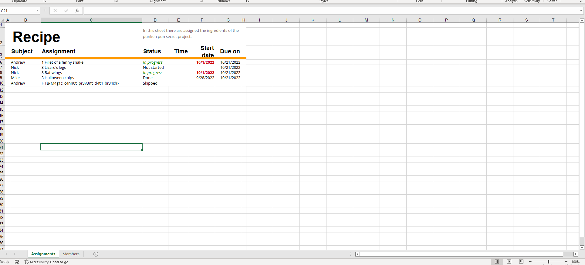

# Forensics - Trick or Breach

For this challenge we started with a PCAP. Now this PCAP was pretty small and also only contained DNS traffic... weird. To the inexperienced eye this might seem normal but over the past few years attackers have gotten clever and have used DNS for sending and receiving data and commands. This looks like a classic case of this.

<figure><figcaption>
The contents of the PCAP
</figcaption></figure>

To extract the data, which is split up into short stings and placed as the subdomain of pumpkincorp.com, we will need to automate the process. To do this I created a small python script, linked [here](https://github.com/gsmith257-cyber/RandomTools/blob/main/dnsExfilPcapParser.py), that extracted each subdomain and linked them all together into one string and printed it out. this allowed me to just copy and paste the data into Cyberchef where, after playing with it for a minute, I realized it was hex. After converting all the hex to data I extracted it as a .dat file and ran the Linux 'file' command on it to see what it actually is.

Linux said it was a MS Excel file, interesting. Taking that hex data I created a new file in HxD on my Windows machine and pasted the hex in and saved it as an .xls file.&#x20;

<figure><figcaption>
Pasting the hex into HxD
</figcaption></figure>

Trying to open that with Excel didn't work so I changed the extension to .xlsx and boom, it opened! Once you opened the file you could see the flag right there, as seen in this photo:

<figure><figcaption></figcaption></figure>
