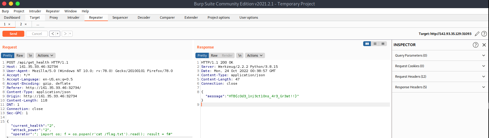

# Web - Evaluation Deck

For this challenge we start with a website and source code for this site. Before even looking at the site I started quickly looking through the source code for anything interesting.

Doing this quick skim I immediately saw a potential code injection vulnerability in '/web\_evaluation\_deck/challenge/application/blueprints/routes.py'. This injection point was an exec function that was doing math for the game on the website, see the code block below:

```python
code = compile(f'result = {int(current_health)} {operator} {int(attack_power)}', '<string>', 'exec')
exec(code, result) #This is the target
return response(result.get('result'))
```

On the website, when you click a card, it sends a POST request that contains the current health, operator, and attack power. As you can see in the code block, the current health and attack power are set to integers and so cannot be modified to do anything nasty by us really. The operator though, usually '+' or '-', can be modified by us and is not set to any type or filtered. I could tell this is where we need to inject.

Now this took a few tries to get it to work correctly but I eventually crafted a working payload to put in the operator argument:

```python
; import os; f = os.popen(r'cat /flag.txt').read(); result = f#
```

In order to edit this argument you will need to use Burp Suite and get a copy of the games POST requests by intercepting it with Burp's proxy. Once you have it you can play around with it as needed in repeater until you get it working like this:

<figure><figcaption><p>Got the flag!</p></figcaption></figure>

&#x20;A nice and fun PWN!
