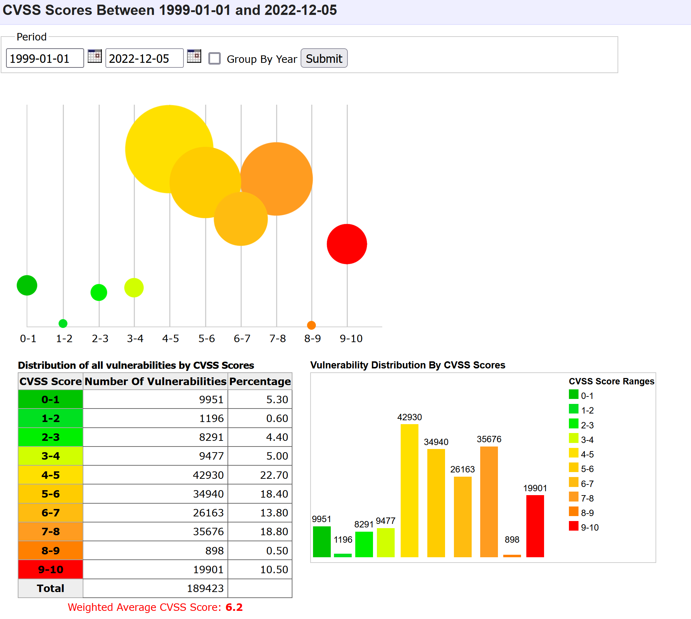
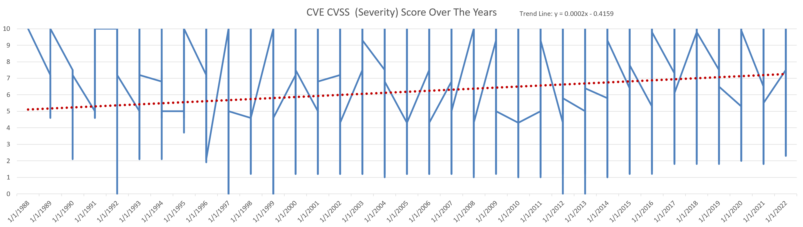
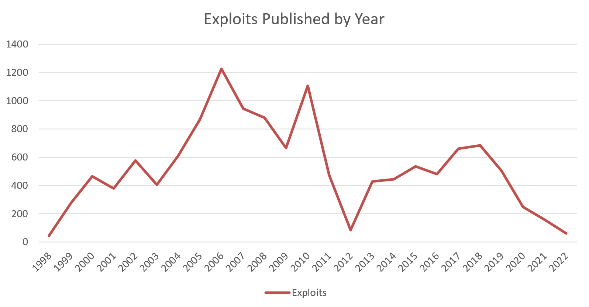

# ⛏ Data Mining CVEs and Exploits

For our data mining project in BIT 3434 we needed to find a topic and we wanted something interesting and not readily available online. This is when we decided to pick data mining in cybersecurity in order to answer this primary question:

> Though there are many Common Vulnerabilities and Exposures (CVEs) out there, and more coming out each day, how many of them are actually exploitable by most threat actors?

To get started with answering this question we need a lot of data. We started by gathering all the CVE data from the [NIST National Vulnerability Database (NVD)](https://nvd.nist.gov/vuln/data-feeds). Each year has its own JSON file, except for years before 2002 but they are included in the 2002 file.

Now that we had each CVE we needed a way to search for exploits. My first thought was that I could search Offensive Security's ExploitDB and GitHub for proof of concept (PoC) scripts. This turned out not to be effective though due to issues parsing and searching ExploitDB correctly and GitHub's rate limiting. In order to parse the well over 100,000 CVEs we would need to do it offline to get anything done in a reasonable amount of time.

This is when I found that [ExploitDB has a CSV file](https://gitlab.com/exploit-database/exploitdb/-/blob/main/files\_exploits.csv) of all the exploits it currently has and most have a tag for the CVE it exploits. This was a game changer for the amount of time that was needed to go through all this data. After doing some math I found I needed around 240 hours of time to parse through all this data with my script. Not too bad, but there was a problem... I had this project due in 120 hours. I had to find a way to drastically improve the speed of my script.

In order to do this I realized that the library I was using to write new rows to the xlsx files was opening and reading the entire file and then writing and then writing it all back again with the new row. This was OK for the first 2000 or so rows but after that it got painstakingly slow. To fix this I made it so after 1000 rows written it will create a whole new xlsx file and start writing to that and it will use the naming format of '{year}\_data{number\_of\_files\_for\_this\_year}.xlsx". This worked perfectly and I got the hours down to around 120 needed. To speed this up I split the task between my laptop and PC, having each do half.

The script, data, and results I made/used for this research is all in [this GitHub repository](https://github.com/gsmith257-cyber/BIT3434CVE).

Now lets look at the results and some other interesting data found!

Before we look at the data we "mined" I wanted to showcase some valuable data I found on [cvedetails.com](https://www.cvedetails.com/cvss-score-charts.php?fromform=1\&vendor\_id=\&product\_id=\&startdate=1999-01-01\&enddate=2022-12-05).

<figure><figcaption><p>CVEdetails.com report</p></figcaption></figure>

In these statistics you can see the overall averages for severity (CVSS) scores, as well as the distribution, throughout the time CVEs have been recorded.

### Background on this technique

Now there have been ways to search for exploits by CVE and vice-versa for many years but no one has taken this data and looked at it in a big picture way as we have done here. The technique used is straight forward but it had to be customized in alot of ways which is why I created my own script. The main reason for scripting it in python was because of the amount of libraries available for this type of work. I needed to be able to compare data from a JSON file to data from a CSV file and then write new data to an xlsx file.

### Process

As I mentioned previously, all data was gathered from Offensive Security's ExploitDB and NIST's NVD. NIST's data is formatted in JSON and so to grab the data on each CVE I used the JSON library in python:

```python
cve_id = data["CVE_Items"][i]["cve"]["CVE_data_meta"]["ID"]
cve_description = data["CVE_Items"][i]["cve"]["description"]["description_data"][0]["value"]
cve_published_date = data["CVE_Items"][i]["publishedDate"]
cve_last_modified_date = data["CVE_Items"][i]["lastModifiedDate"]
```

After gathering this data I would search for the cve\_id variable in the tags column of the ExploitDB CSV file:

```python
def exploitdb_searching(name):

    #parse the files_exploits.csv file
    try:
        with open('files_exploits.csv', 'rt', encoding='utf-8') as f:
            reader = csv.reader(f, delimiter=',')
            for s in reader:
                if s[11][:13] == name:
                    row = s
        #get the description from the row
        description = row[2]
        #get the date published from the row
        date = row[3]
        #get the file from the row
        file = row[1]
        #return an array of the description, date, and file
    #except
    except Exception as e:
        description = []
        date = []
        file = []
    return [description, date, file]
```

In this function if it did not find a tag with the CSV ID then it would throw an exception and I would catch that and return empty arrays because nothing was found.

If it found a exploit that matched it would write it in the same row as the CVE and if not then it would write "None".

#### Statistics

Before I reveal the new data I want to share some statistics about my experience parsing this data:

* Total hours processing data: 128
* Computers Used: 2
* Rows written (before cleanup): 185,023
* CVEs Processed: 175,026


### Results

Now, to the new data. With our main question being "Though there are many CVEs out there, and more coming out each day, how many of them are actually exploitable by most threat actors?" We got this answer as a result:

```
Percentage of CVEs that have public exploits: 7.591%
```

Now this was shockingly low. I had expected there to be at least 20% of CVEs. This just goes to show that despite the massive amount of CVEs that are published each year most attackers are only exploiting 7.6% of them.

> ...despite the massive amount of CVEs that are published each year most attackers are only exploiting 7.6% of them.

Our next interesting find was that the severity of each CVE is trending upwards, which can be seen in this graph and trend line:

<figure><figcaption><p>Data on CVE CVSS Score by year</p></figcaption></figure>

We also gathered how many exploits were posted by year and here is the graph for this data:

<figure><figcaption><p>Exploits published by year on ExploitDB</p></figcaption></figure>

All this data/script/results can be found on [my GitHub here](https://github.com/gsmith257-cyber/BIT3434CVE). The final sheet with all the data is in the results folder and is named 'allData.xlsx'.

### Why is this data valuable to business?

Many medium to large companies that have a mature security posture have threat intelligence employees or teams. These teams have to search through large amounts of data on the newest CVEs and what threat actors are doing. Having hard data to show that they need to focus on CVEs that can actually be exploitable, the vast minority of CVEs, allows them to justify not tracking each new vulnerability out there until an exploit or suspicion of exploitation comes out.

This data can also be used to track trends in exploits and, if further dug into, can be used to identify what types of devices are being exploited more commonly and how. These trends can be helpful for companies during table top exercises as well as real world defending and threat intelligence.

### Summary

So why was this research important? As we get flooded with new, amazing CVEs that can gain remote code execution (RCE) on all these different systems and services, it is important to take a step back and look at the reality of how much is actually used in common attacks. We provide this data with our research here and it can be used by researchers to look for their own trends or build on their own datasets.

It is also my firm belief that as we get more reliant on technology the more vulnerable we are to it breaking. While correlation is not causation it is notable that the severity of CVEs continues trending upwards.

### Sources:




