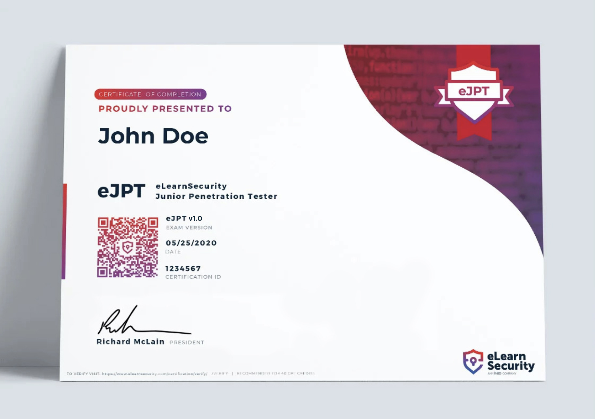
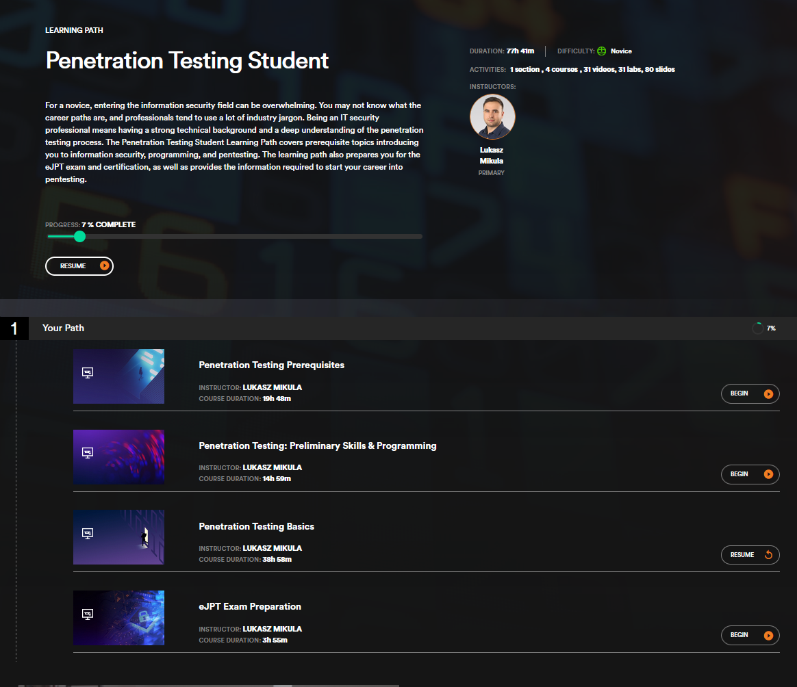

# 👾 eJPT certification Review



In this post I'll cover my thoughts on the eJPT certification. I took the eJPT exam recently because it was recommended by a fellow student to help prep for the OSCP exam and get a foot in the door with an entry level certification for pen testing. To cover my thoughts on this l'll go over three sections: The prep, practice labs, and the exam itself.

## Prep

To prepare for the course I used INE's free starter pass which gave me access to the Penetration Testing Student course. This course consists of four sections as seen in the picture below.



Because I had some experience in programming and pen testing I skipped the first two sections and went into Penetration Testing Basics. Throughout this course I was able to get some really good tips and tricks and learn in-depth about some of the techniques I was using. Some of the topics covered were: subnet enumeration, ARP poisoning, SMB shares, Shells, backdoors, and various web vulnerabilities. Though not all of these are used on the exam it was a great course that covered a lot of content, and its completely free. Throughout this course you complete multiple labs as well, these labs will cover specific areas, such as ARP poisoning and BurpSuite usage, until you reach the end where you have three Black Box Labs.

## The Practice Labs

Throughout the course the labs you get access to are great and there is even a beta feature where you can control a Kali VM through your browser that they host, making setting up for labs much easier. While each of the labs is focused on a specific are the final three labs, the Black Boxes, are more like Hack the Box machines. These you are just given an IP and told to go. These were not particularly hard labs but they were harder than the exam boxes that you are given access to. They are great practice and its worth going through them for practice even if some of the content is not on the exam. Following completing these labs is when I started my exam.

## The Exam

It is well known that the exam is a corporate network that you start inside of. There is no need to break in to gain internal access as it is given through your VPN connection. The network is over OpenVPN so make sure you know how to setup the connection before hand when you start. Once you do start you are given a packet that covers the scope of the exam and any details you might need. You are also given a packet capture that you will use as part of the exam, you don't need to have in-depth knowledge of how to read it but know how a network works and generally whats going on with that capture.

Once you receive those items you are also given access to the online quiz which is the graded portion of the exam. This quiz covers knowledge that you could only get by breaking into the machines on the network. This quiz can also give you hints of what you are looking for if you read the questions.

Though the course and labs teach you most of what you need to know before the exam there are two pieces of information I was missing: Identifying routers, and knowing how to route through a router to another network. Make sure you know how to identify the routers because nmap will not be much help with that, and as for routing, use this command:

```
ip route add 10.x.x.0/24 via 192.168.x.x
```

## Conclusion

Overall I think this is an amazing starter certification and I have heard other industry experts say the same. It is great prep for the OSCP and is also that foot in the door that you need, as well as being cheap, at $200 for two exam attempts. The only con is that it is not very well known and most people dont know what it consists of. Compared to a cert like CEH or Sec+ it can't do much even though you need more practical knowledge to complete the eJPT than the CEH exam. My recommended cert pathway from here is: Sec+, Pentest+, GPEN, OSCP, CISSP. In that order.
