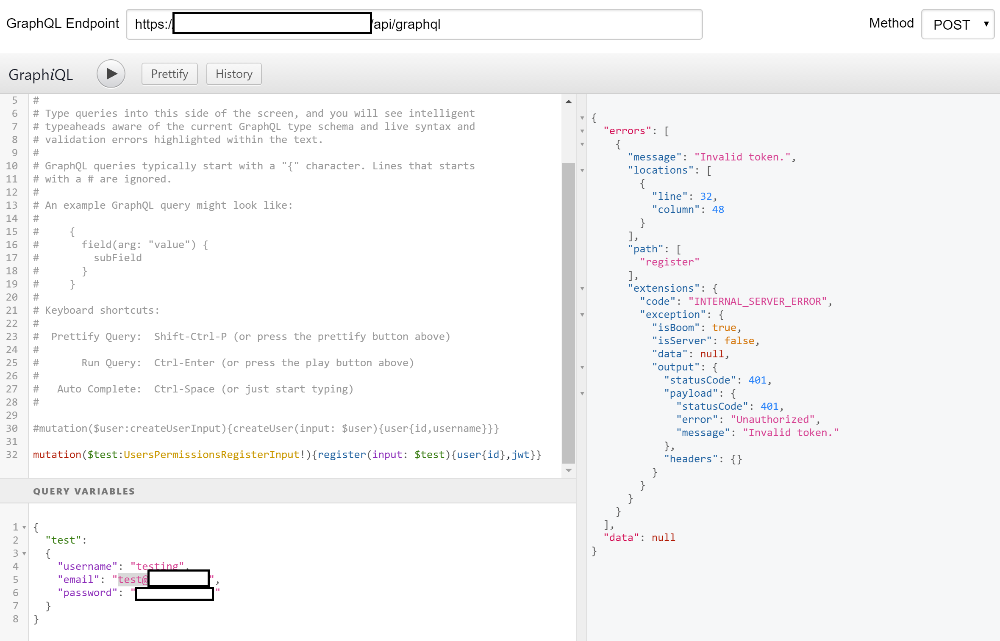

# 📊 GraphQL Query Authentication Bypass Vuln

These past few weeks I have been looking around a lot of sites for vulnerability research, as many of us do, and I kept coming across GraphQL endpoints. These endpoints, in most cases required authentication and when you tried to do something in the schema it would say unauthorized, like this:

&#x20;So its secure right? We can't run anything we shouldn't be able to right? Well that's what I though when I looked them over but when I looked around one last site with a similar endpoint to the rest I noticed that the "Forgot Password" feature was interacting with the GraphQL endpoint for the site. In other words, it was successfully able to query the endpoint when I wasn't. So why was that? If we go and look at the query we can see that it has a few fields:

The first is the operationName, for this its forgotPassword, then we have the variables and the query, just like normal GraphQL. There seems to be a security feature in place though so when you send a different query than the operation is intended for it will give you an unauthorized error. Ok thats smart, what if we try to change the operation name to other tasks...same errors. Ok lets try one last thing, lets let the query that is supposed to happen run and then lets add a second one to the end and see if it executes...

If you read through the above image you will see that I added a variable called "test" for the data I wanted to send it for creating a user on the site, along with adding the register mutation to the end of the forgotPassword mutation in the query field. This resulted in what you see on the right. We get an error because the random email I entered was not found but then we also can see the id and JWT of a brand new user, created with the information we provided. I tried logging in and it had worked!

**Overall** this vulnerability allows for an unauthenticated user to place variables in a query along with execute commands that include read/write/edit access to the back end of the webserver and can definitely lead to RCE in some cases.

Now I have not found anyone else who has identified this type of vulnerability in GraphQL or any back end auth system so I am unsure if this was an auth system made in house or one that a third party provides, which would make this my first CVE, so if anyone has any clue based on the photos provided please reach out to me on LinkedIn or Twitter.
