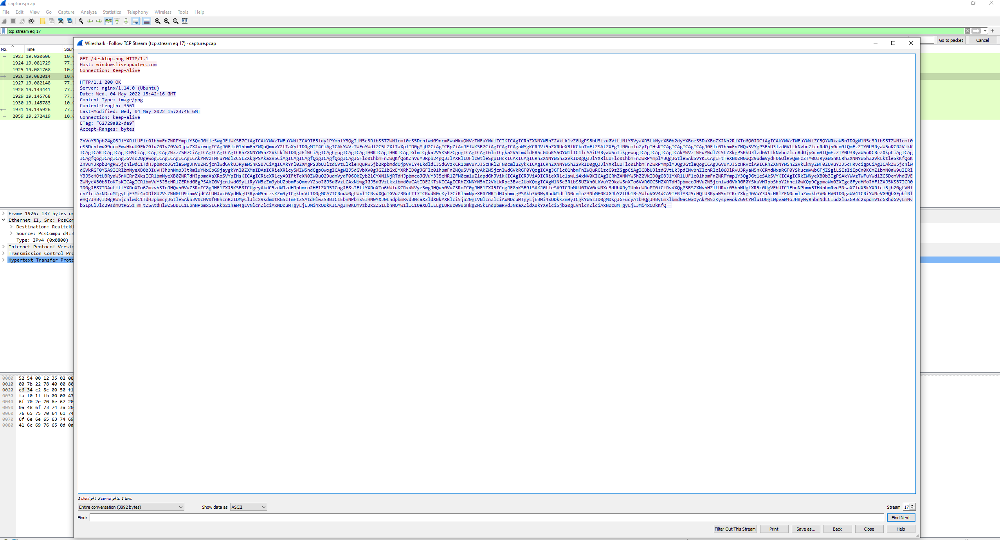
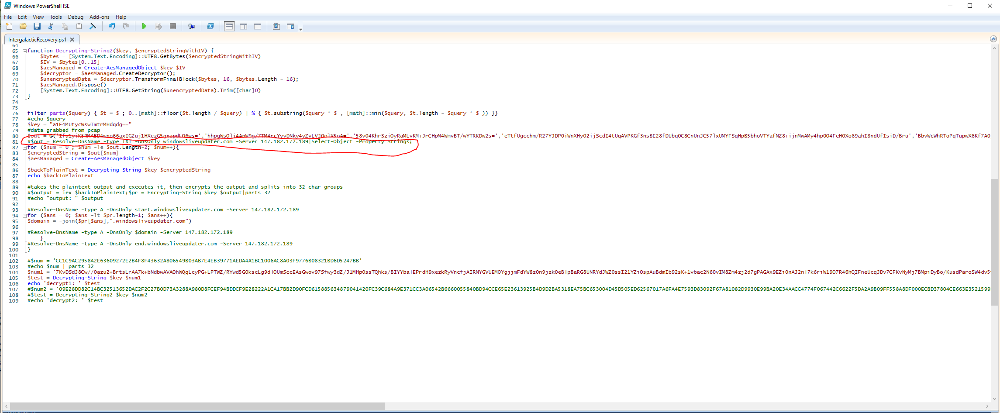

# Forensics - Automation

For this challenge we started with a PCAP, or packet capture, file. Just from scrolling through briefly I noticed one http steam that seemed interesting. It was requesting a desktop.png file but this file was base64 encoded. I copied this text over to CyberChef and decoded it.

I edited the payload not to execute anything on my machine and started reading through. From what I read it was grabbing all the subdomains of a website through DNS and then decrypting the subdomain so if it received one like XYSEF.windowsliveupdater.com it would split it so XYSEF was left and then decrypt it, run it, and send the response back over DNS to the website. This was really cool and sneaky.

Looking back at the packet capture we can see where this happens and I grabbed all the subdomains it got and decrypted them using the script and got this:

.PNG>)

If you base64 decode the user it adds on the second to last line you get the first part of the flag. That means we are going to have to dig a little deeper to find the second part and its probably in the responses being sent back.

I grabbed each response, which were separated by a start.windowsliveupdater.com and an end.windowsliveupdater.com, and decrypted them one at a time until I got to the part two of the flag:

.PNG>)

Now we had the complete flag and I submitted it!

PWNED!!
