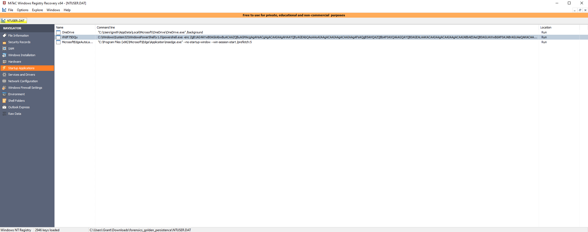
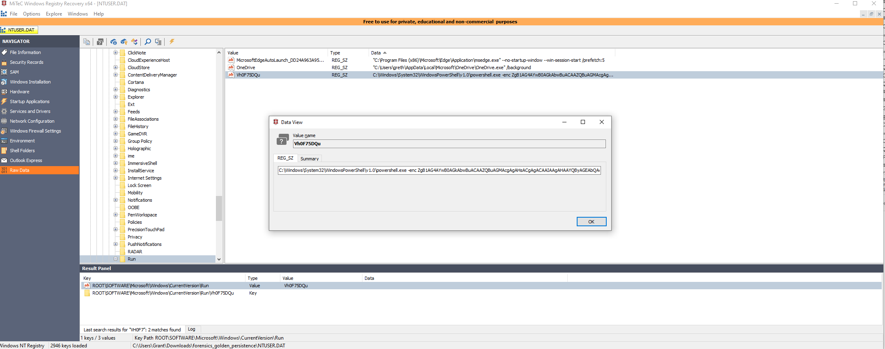
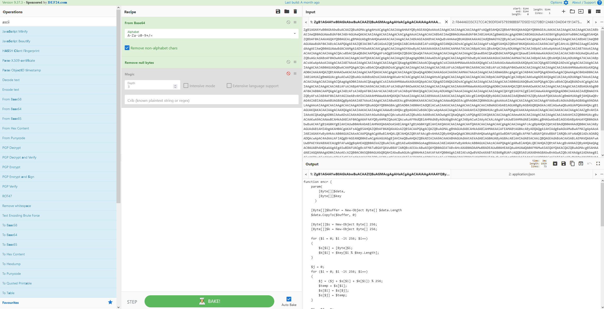
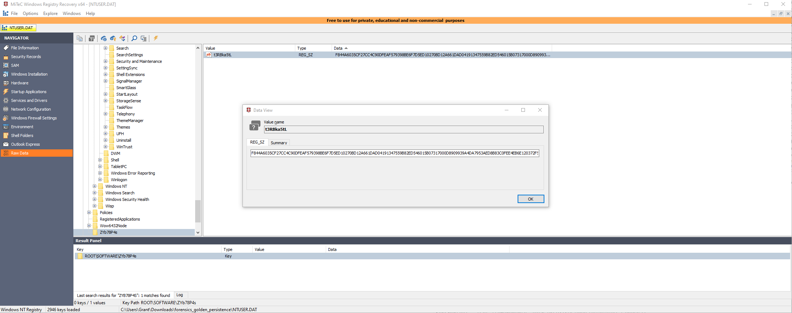
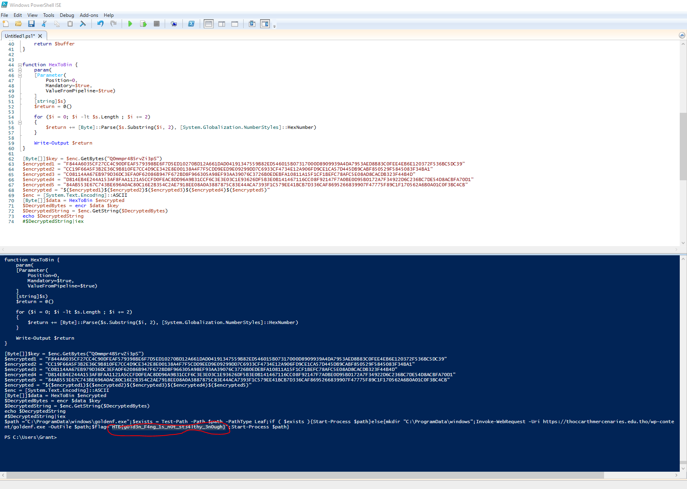

# Forensics - Golden Persistence

For this one we started with an NTUSER.DAT file. I went ahead and opened it in MiTeC Windows Registry Recovery which allows me to explore the entire file easily. From looking around briefly we can see there is a startup process being run that executes an encoded powershell script.



To view the whole command and copy it I headed over to the raw data section and searched for the name.



Once that popped up I copied the encoded text and plugged it into CyberChef.



Towards the bottom it grabs a few other files and uses their data conjoined to load the encrypted data.

```
[Byte[]]$key = $enc.GetBytes("Q0mmpr4B5rvZi3pS")
$encrypted1 = (Get-ItemProperty -Path HKCU:\SOFTWARE\ZYb78P4s).t3RBka5tL
$encrypted2 = (Get-ItemProperty -Path HKCU:\SOFTWARE\BjqAtIen).uLltjjW
$encrypted3 = (Get-ItemProperty -Path HKCU:\SOFTWARE\AppDataLow\t03A1Stq).uY4S39Da
$encrypted4 = (Get-ItemProperty -Path HKCU:\SOFTWARE\Google\Nv50zeG).Kb19fyhl
$encrypted5 = (Get-ItemProperty -Path HKCU:\AppEvents\Jx66ZG0O).jH54NW8C
$encrypted = "$($encrypted1)$($encrypted2)$($encrypted3)$($encrypted4)$($encrypted5)"
$enc = [System.Text.Encoding]::ASCII
[Byte[]]$data = HexToBin $encrypted
$DecryptedBytes = encr $data $key
$DecryptedString = $enc.GetString($DecryptedBytes)
$DecryptedString|iex
```

I went through and found each of these files and grabbed the data from them and plugged it into the powershell script manually.



After doing this I made sure nothing would execute and then I ran it so it would print out the encrypted data in plaintext and there was the flag.



PWNED!!
