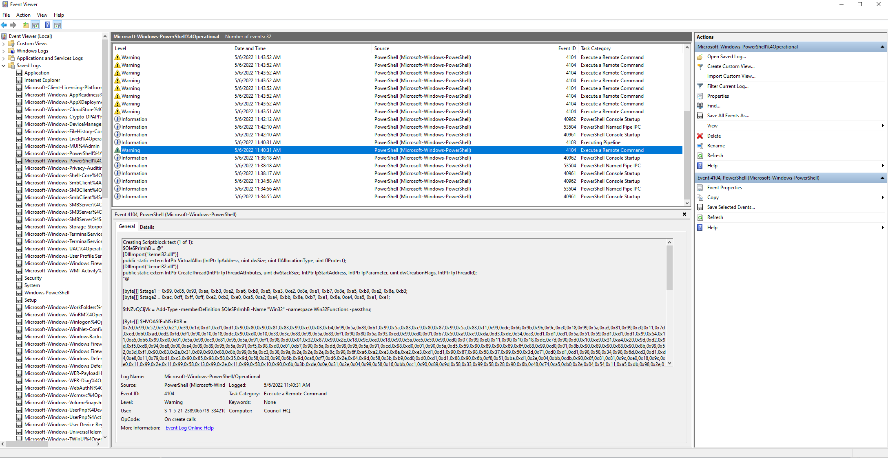
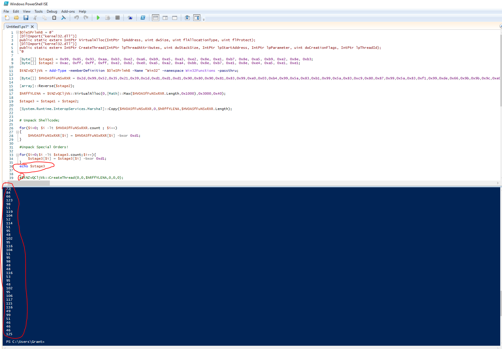
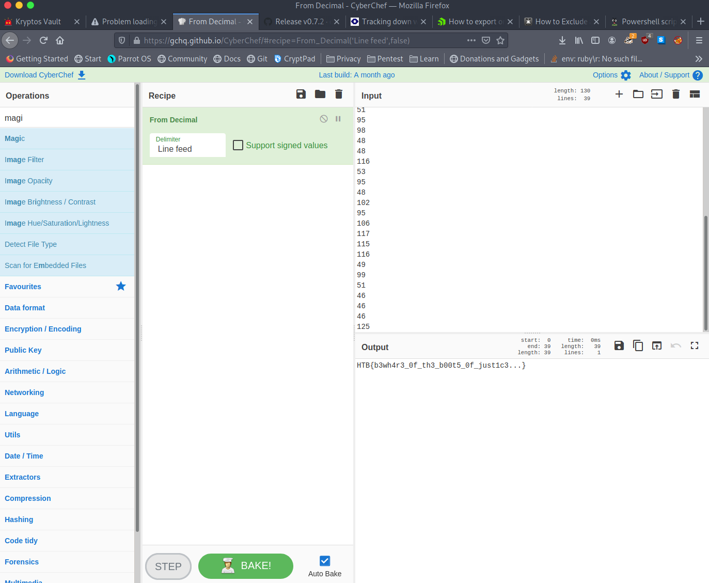

# Forensics - Puppeteer

To start we were given a large number of event log files (.evtx). To view these you can open them in Event Viewer on Windows. After looking through them a bit I drifted toward the powershell logs and thats when I found the first part in "...Powershell%40Operational".

As you can see above there is an obfuscated powershell script being created. This is most likely something malicious so lets go look into it in Powershell ISE.

After pasting in the script I made sure it wouldnt execute anything and added an echo statement to print out the variable $stage3. This printed out a bunch of numbers which I immediately knew were representing characters so I plugged them into CyberChef and cha ching...

PWNED!!
