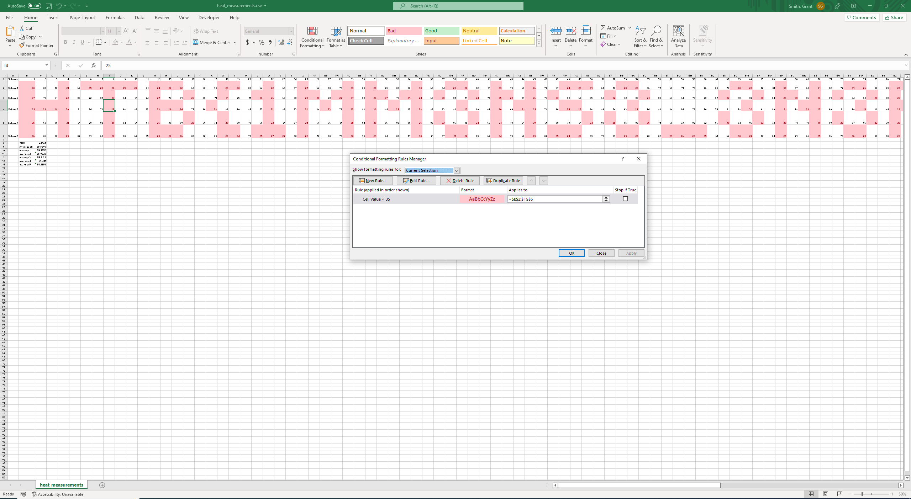

# Misc - Matrioshka Brain

This challenge had less than 200 solves last I checked. It really involves thinking outside the box and not just looking for hidden VBA scripts or steganography.

To start off we are given a .csv file and told there are inconsistencies in the numbers in it. I opened it in excel and got the average of all the data. I went to conditional formatting to spot the outliers and immediately noticed stuff kinda like words when I highlighted all the ones above average. I switched it over to below average and boom:

PWNED?? (Maybe)
