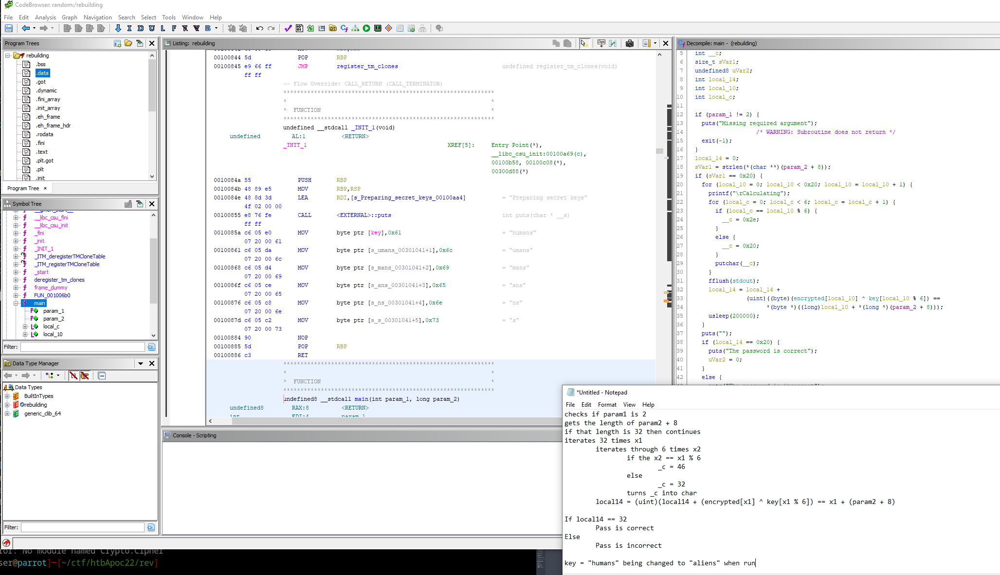
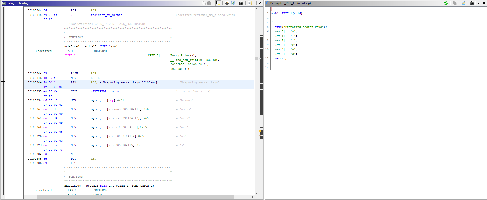
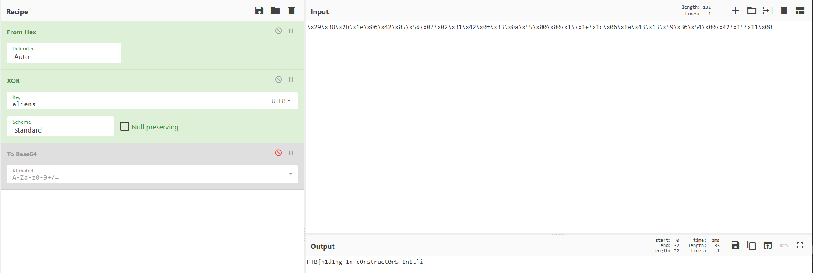

# Reversing - Rebuilding

This challenge starts out with a binary that we can just plug into Ghidra. Once you load it and analyze it you can see in the main function this:

I have a little translation of what is happening in notepad in the bottom right of the photo, I was up late and rushing. Basically it was grabbing the encrypted data and key and performing an XOR to compare each character to see if the password was correct. This xor key was "human" and so we thought we had it but turns out that wasn't right as we got a bunch of garbled data. Turns out there was a little trick happening when it was run...

It was changing the key from "humans" to "aliens". Now if you just use that as the key in CyberChef you can get the flag.

PWNED!!
