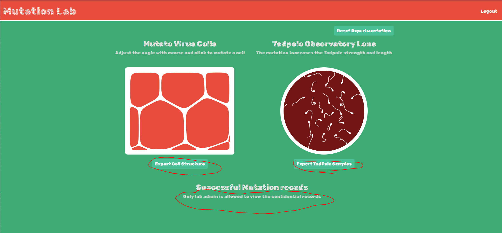
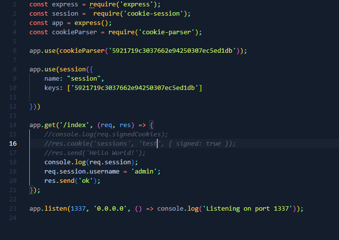

# Web - Mutation Lab

To start off with we are shown a login screen. This screen also has a register account button on it and that is what I utilized first to see what is past the login page.

After logging in we can see an interesting dashboard. After messing around a bit I found a key feature that I will most likely be able to exploit and what I am going after.

As you can see, from the circled text above there are confidential records, the flag most likely, that only the admin can view. So I need to view this page as an admin. There is also a feature that allows you to export the samples you make as images. To do this it uses a backend feature called 'convert-svg-core' which has a CVE POC for local file inclusion (LFI), [https://security.snyk.io/vuln/SNYK-JS-CONVERTSVGCORE-1582785](https://security.snyk.io/vuln/SNYK-JS-CONVERTSVGCORE-1582785) , which we could possibly exploit in this website. After a tiny bit of manipulation we got it working! We were blind in this environment but because it is a node.js app we were able to find the index.js file at /app/index.js which gave me a better insight into this web applications backend.

In this file we can see a reference to /app/.env ... Lets check it out.

A session secret key! This is big because from this applications index.js file we can see it being used to create sessions using just the username and the secret. Now we just have to replicate that on our own machine and create a session for the admin account with the secret and replace our current account session with the new admin one.

This took longer than it should have but I eventually got an exact replica of my own session using the username 'test' using this locally:

Now I just changed the username being used to 'admin' and refreshed the dashboard and there the flag was.

PWNED!!
