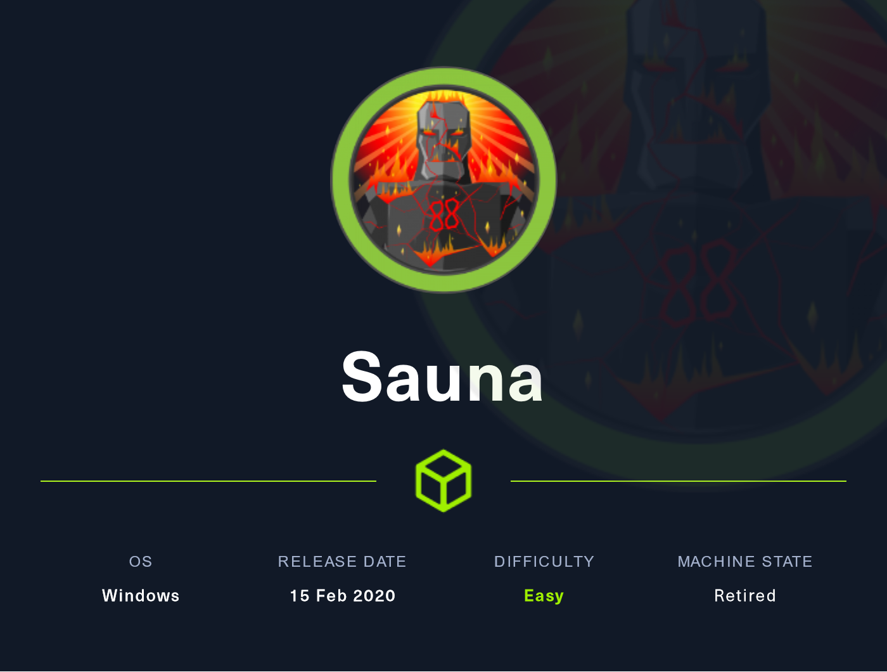
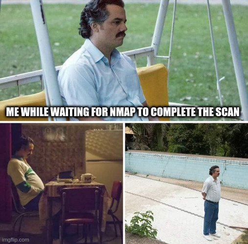
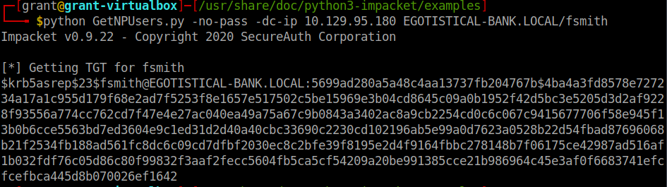
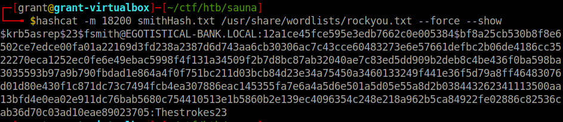
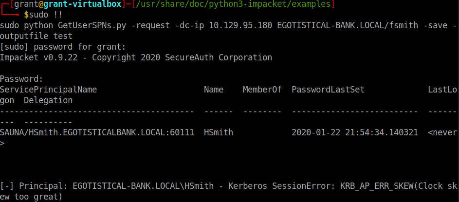
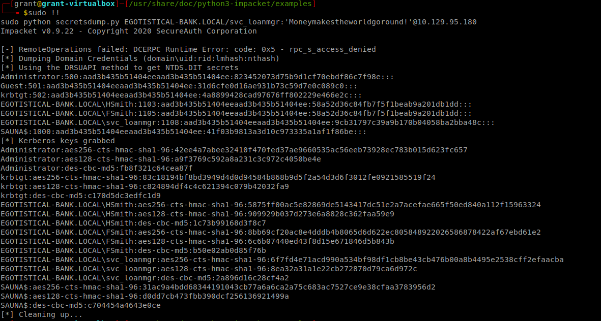
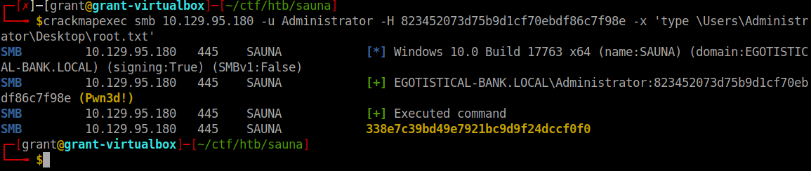

# 🔥 Sauna Writeup



Lets start with an nmap scan :)



```
Nmap scan report for 10.129.95.180
Host is up (0.085s latency).
Not shown: 988 filtered tcp ports (no-response)
PORT     STATE SERVICE       VERSION
53/tcp   open  domain        Simple DNS Plus
80/tcp   open  http          Microsoft IIS httpd 10.0
|_http-server-header: Microsoft-IIS/10.0
|_http-title: Egotistical Bank :: Home
| http-methods: 
|_  Potentially risky methods: TRACE
88/tcp   open  kerberos-sec  Microsoft Windows Kerberos (server time: 2022-05-29 09:31:42Z)
135/tcp  open  msrpc         Microsoft Windows RPC
139/tcp  open  netbios-ssn   Microsoft Windows netbios-ssn
389/tcp  open  ldap          Microsoft Windows Active Directory LDAP (Domain: EGOTISTICAL-BANK.LOCAL0., Site: Default-First-Site-Name)
445/tcp  open  microsoft-ds?
464/tcp  open  kpasswd5?
593/tcp  open  ncacn_http    Microsoft Windows RPC over HTTP 1.0
636/tcp  open  tcpwrapped
3268/tcp open  ldap          Microsoft Windows Active Directory LDAP (Domain: EGOTISTICAL-BANK.LOCAL0., Site: Default-First-Site-Name)
3269/tcp open  tcpwrapped
Service Info: Host: SAUNA; OS: Windows; CPE: cpe:/o:microsoft:windows

Host script results:
|_clock-skew: 7h00m01s
| smb2-time: 
|   date: 2022-05-29T09:31:49
|_  start_date: N/A
| smb2-security-mode: 
|   3.1.1: 
|_    Message signing enabled and required
```

We can see right away that there are a good amount of ports open with only a few being interesting. The first I saw was port 80, http, being open. Was this going to be a web challenge for a foothold? I also saw 445 and 139 were open, so some SMB enumeration was in store as well. We can also see that this is probably a domain controller because of AD LDAP running and Kerberos.&#x20;

I started by looking at the website but got nowhere with that after being stuck for a while. I switched gears and tried to get some info from LDAP where I gathered some vital information for the next phase.

```
ldapsearch -x -h 10.129.95.180 -s base namingcontexts
	namingcontexts: DC=EGOTISTICAL-BANK,DC=LOCAL
```

This allowed me to run kerbrute on the box and get some usernames that I can leverage to try to get access.

```
./kerbrute userenum -d EGOTISTICAL-BANK.LOCAL /home/grant/ctf/SecLists-master/Usernames/xato-net-10-million-usernames.txt --dc 10.129.95.180
		2022/05/28 20:31:17 >  [+] VALID USERNAME:	 administrator@EGOTISTICAL-BANK.LOCAL
		2022/05/28 20:32:40 >  [+] VALID USERNAME:	 hsmith@EGOTISTICAL-BANK.LOCAL
		2022/05/28 20:33:38 >  [+] VALID USERNAME:	 fsmith@EGOTISTICAL-BANK.LOCAL
```

We can try a few things with these usernames we now have and the first that comes to mind, because I did it on another box recently, was AS-REP roasting. This is where we try to see which accounts don't have Kerberos preauthentication required and then grab the ticket from them and crack it offline. To do this I'm using the handy dandy impacket repo, as all good infosec professionals do.



After trying each account we got a hit on fsmith! Now to crack it...



And there it is. fsmith's password is 'Thestrokes23'.

Login in with evil-winrm we can grab user.txt now. Onto the priv esc...

Using this info I immediately thought of the boxes name and went to Kerberoasting and I think it should have worked...should have.



I kept getting this error about the clock skew being too great. I tried everything I could to fix it. I ran 'ntpdate 10.129.95.180' and a bunch of other junk but none of it worked. I felt like this box just didn't work anymore and I wouldn't be able to solve it.

I went and took a break and came back ready to try another route. This time I started doing some deeper enumeration. Using this great blog I found about stored credentials, [linked here](https://pentestlab.blog/2017/04/19/stored-credentials/), I found something...&#x20;

.PNG>)

In this we can see the default password for svc\_loanmanager_, or as I found out later after some trial and error,_ svc\_loanmgr. We login as this new user we have access to and I do some more searching, finding nothing of use. I then made a transition to different tool...

I used sharphound to grab the data I needed and plugged it into bloodhound for analysis. After looking through I could see that we needed to do a DCSync attack. We already had the right privileges with svc\_loanmgr so all we needed to do was just run secretsdump.py, another impacket tool.



We had the Administrator hash!! Lets go crack it. Oh wait... Its not in my wordlists? Welp maybe that's not the way.

After some fiddling around I tried passing the hash using crackmapexec. Boom it worked. Now all I had to do was grab the flag.



PWNED!!
